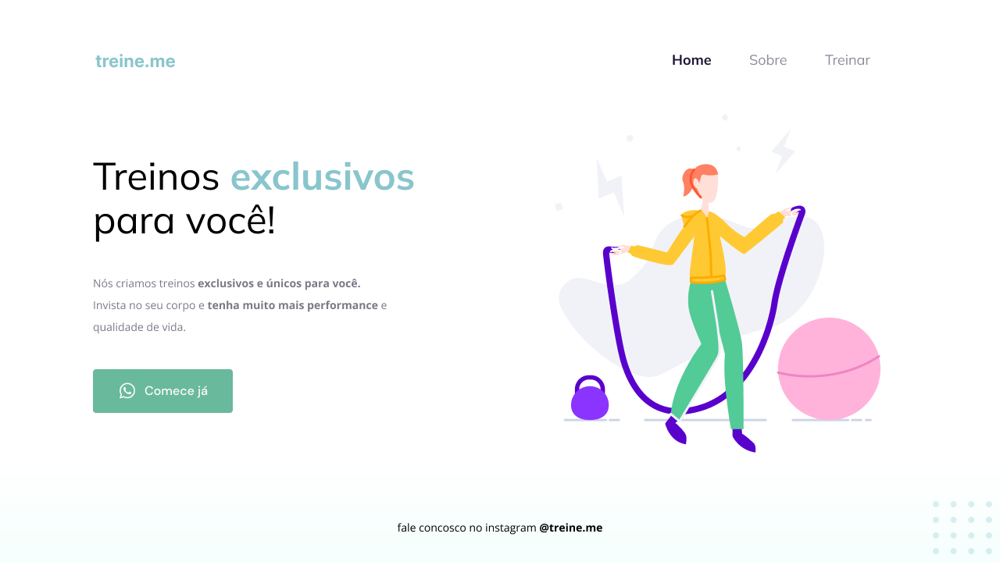

<h1 align="center"> Código do desafio - Fase 02 </h1>

  <a href="#-tecnologias">Tecnologias</a>&nbsp;&nbsp;&nbsp;|&nbsp;&nbsp;&nbsp;
  <a href="#-projeto">Desafio</a>&nbsp;&nbsp;&nbsp;|&nbsp;&nbsp;&nbsp;
  <a href="#-layout">Layout</a>

 

## 🚀 Tecnologias

Esse projeto foi desenvolvido com as seguintes tecnologias:

- HTML e CSS
- Git e Github
- Figma

## 💻 Sobre o desafio

Nesse desafio, foi recebido um código que sofreu algumas alterações, assim sendo realizado as correções conforme o layout correto.

Código com erro:

<a href=".github/index.html" download="index.html">Download do html</a>

<a href=".github/style.css" download="style.css">Download do css</a>

  

- [Acesse o projeto finalizado, online](https://renanbonani.github.io/CodigoDesafio-Fase02)

## 🔖 Layout

  

